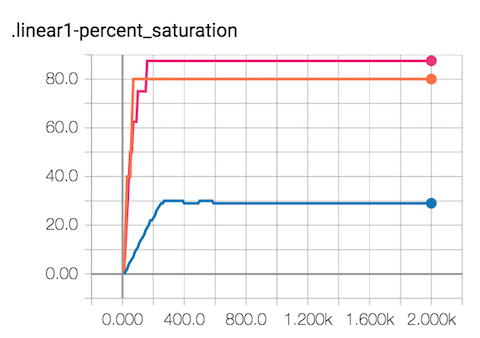
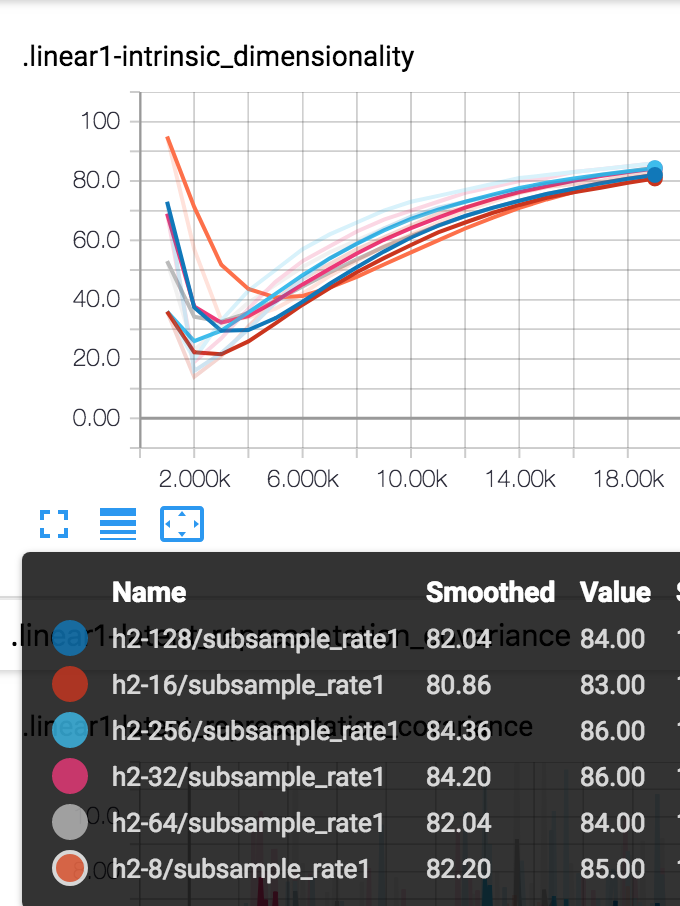
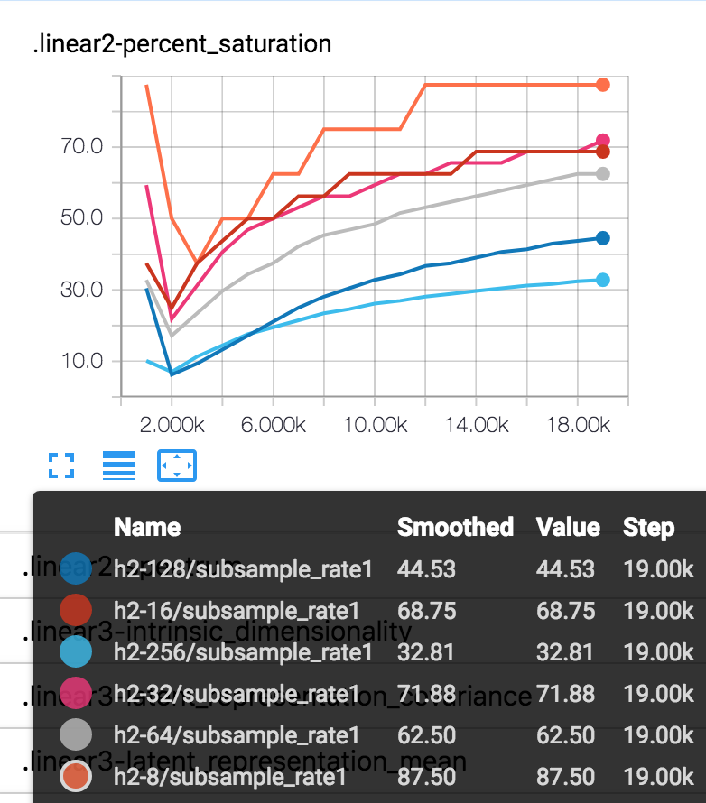

# delve

Inspect layer saturation and spectral data in your PyTorch models.

**delve**, *verb*:
```
1. Reach inside a receptacle and search for something
2. Research or make painstaking inquiries into something
```
## Getting started

```bash
pip install delve
```

Tested on Python3

### Layer Saturation
Pass a PyTorch model (or layers) to CheckLayerSat:

```python
from delve import CheckLayerSat

model = TwoLayerNet()
layers = [model.linear1, model.linear2]
stats = CheckLayerSat('runs', layers)
```

Compare models with varying length layers (here 5, 8 and 10) to optimize network topology:



### Spectral analysis

Plot the top 5 eigenvalues of each layer:

```python
stats = CheckLayerSat('runs', layers, 'spectrum')
```


### Intrinsic dimensionality

View the intrinsic dimensionality of models in realtime. For example, see how modifying the hidden layer size of this network affects the second layer saturation but not the first:





This comparison suggests that the 8-unit layer is too saturated and that a larger layer is needed.
