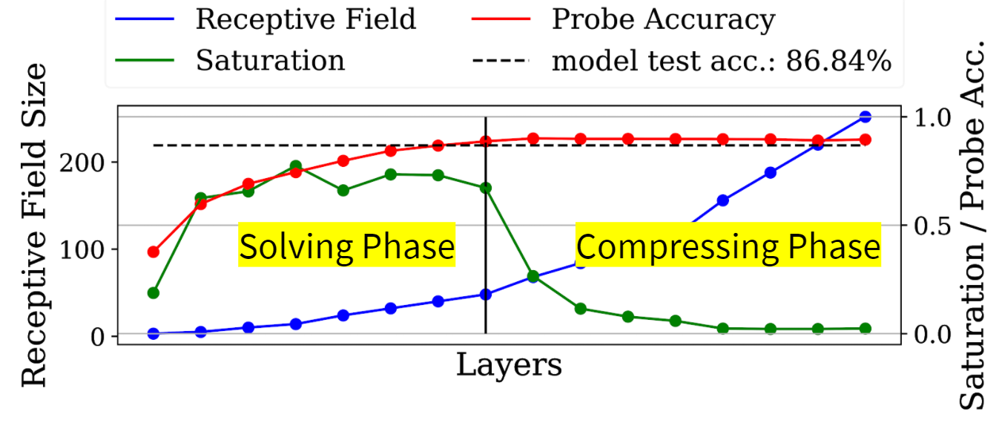
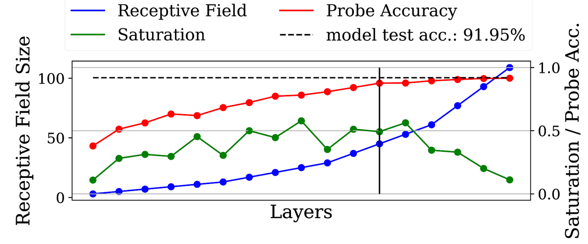

# Delve: Deep Live Visualization and Evaluation 

[](https://badge.fury.io/py/delve) [](https://travis-ci.org/delve-team/delve) [](https://opensource.org/licenses/MIT)

Delve is a Python package for analyzing the inference dynamics of your model.


Use Delve if you need a lightweight PyTorch extension that:
- Gives you insight into the inference dynamics of your architecture
- Allows you to optimize and adjust neural networks models to your dataset
  without much trial and error
- Allows you to analyze the eigenspaces your data at different stages of inference
- Provides you basic tooling for experiment logging

------------------

## Motivation

Designing a deep neural network is a trial and error heavy process that mostly revolves around comparing 
performance metrics of different runs.
One of the key issues with this development process is that the results of metrics not realy propagte back easily
to concrete design improvements.
Delve provides you with spectral analysis tools that allow you to investigate the inference
dynamic evolving in the model while training.
This allows you to spot underutilized and unused layers. Missmatches between
object size and neural architecture among other inefficiencies.
These observations can be propagated back directly to design changes in the architecture even before
the model has fully converged, allowing for a quicker and mor guided design process. 

## Installation

```bash
pip install delve
```


### Using Layer Saturation to improve model performance
The saturation metric is the core feature of delve. By default saturation is a value between 0 and 1.0 computed
for any convolutional, lstm or dense layer in the network.
The saturation describes the percentage of eigendirections required for explaining 99% of the variance.
Simply speaking, it tells you how much your data is "filling up" the individual layers inside 
your model.

In the image below you can see how saturation portraits inefficiencies in your neural network.
The depicted model is ResNet18 trained on 32 pixel images, which is way to small for 
a model with a receptive field exceeding 400 pixels in the final layers.



To visualize what this poorly chosen input resolution does to the inference, we trained logistic regressions on the output of 
every layer to solve the same task as the model.
You can clearly see that only the first half of the model (at best) is improving 
the intermedia solutions of our logistic regression "probes".
The layers following this are contributing nothing to the quality of the prediction!
You also see that saturation is extremly low for this layers!

We call this a *tail* and it can be removed by either increasing the input resolution or
(which is more economical) reducing the receptive field size to match the object size of your
dataset.



We can do this by removing the first two downsampling layers, which quarters the growth 
of the receptive field of your network, which reduced not only the number of
parameters but also makes more use of the available parameters, by making more layers
contribute effectivly!

__For more details check our publication on this topics__
- [Spectral Analysis of Latent Representations](https://arxiv.org/abs/1907.08589)
- [Feature Space Saturation during Training](https://arxiv.org/abs/2006.08679)
- Size Matters (soon)


## Demo

````python

import torch
from delve import CheckLayerSat
from torch.cuda import is_available
from torch.nn import CrossEntropyLoss
from torchvision.datasets import CIFAR10
from torchvision.transforms import ToTensor, Compose
from torch.utils.data.dataloader import DataLoader
from torch.optim import Adam
from torchvision.models.vgg import vgg16

# setup compute device
from tqdm import tqdm

if __name__ == "__main__":

    device = "cuda:0" if is_available() else "cpu"

    # Get some data
    train_data = CIFAR10(root="./tmp", train=True,
                         download=True, transform=Compose([ToTensor()]))
    test_data = CIFAR10(root="./tmp", train=False, download=True, transform=Compose([ToTensor()]))

    train_loader = DataLoader(train_data, batch_size=1024,
                              shuffle=True, num_workers=6,
                              pin_memory=True)
    test_loader = DataLoader(test_data, batch_size=1024,
                             shuffle=False, num_workers=6,
                             pin_memory=True)

    # instantiate model
    model = vgg16(num_classes=10).to(device)

    # instantiate optimizer and loss
    optimizer = Adam(params=model.parameters())
    criterion = CrossEntropyLoss().to(device)

    # initialize delve
    tracker = CheckLayerSat("my_experiment", save_to="plotcsv", modules=model, device=device)

    # begin training
    for epoch in range(10):
        model.train()
        for (images, labels) in tqdm(train_loader):
            images, labels = images.to(device), labels.to(device)
            prediction = model(images)
            optimizer.zero_grad(set_to_none=True)
            with torch.cuda.amp.autocast():
                outputs = model(images)
                _, predicted = torch.max(outputs.data, 1)

                loss = criterion(outputs, labels)
            loss.backward()
            optimizer.step()

        total = 0
        test_loss = 0
        correct = 0
        model.eval()
        for (images, labels) in tqdm(test_loader):
            images, labels = images.to(device), labels.to(device)
            outputs = model(images)
            loss = criterion(outputs, labels)
            _, predicted = torch.max(outputs.data, 1)

            total += labels.size(0)
            correct += torch.sum((predicted == labels)).item()
            test_loss += loss.item()
    
        # add some additional metrics we want to keep track of
        tracker.add_scalar("accuracy", correct / total)
        tracker.add_scalar("loss", test_loss / total)

        # add saturation to the mix
        tracker.add_saturations()

    # close the tracker to finish training
    tracker.close()

````

### Why this name, Delve?

__delve__ (*verb*):

   - reach inside a receptacle and search for something
   - to carry on intensive and thorough research for data, information, or the like
