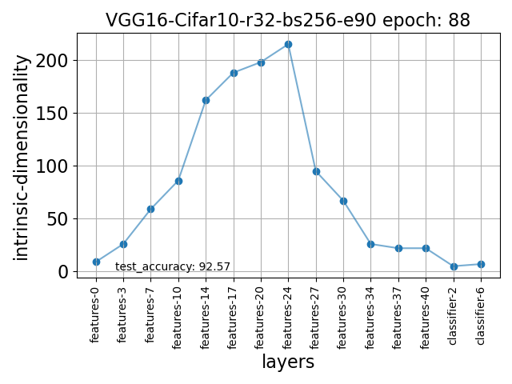
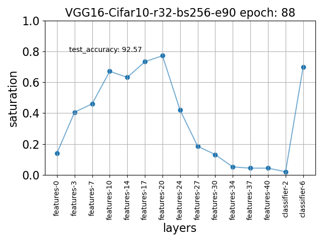
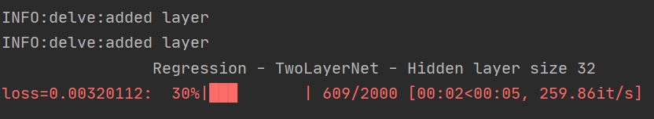

Examples
========

Delve allows the user to create plots and log records in various formats.

Plotting
--------

Delve allows plotting results every epoch using ``save_to="csvplot"``, which will create automated plots from the metrics
recorded in the ``stats`` argument. The plots depict the layers generally in order of the forward pass.

Automatically generated plot of intrinsic dimensionality computed on the training set of Cifar10 on  VGG16 at the 88th epoch of a 90 epoch of training.

Automatically generated plot of saturation computed on the training set of Cifar10 on  VGG16 at the 88th epoch of a 90 epoch training.

Logging
-------

Delve logs results with the ``logging`` package and shows progress with ``tqdm``.

A simple example generated from a two-layer network trained on randomly generated data is provided in :ref:`sphx_glr_gallery`.
