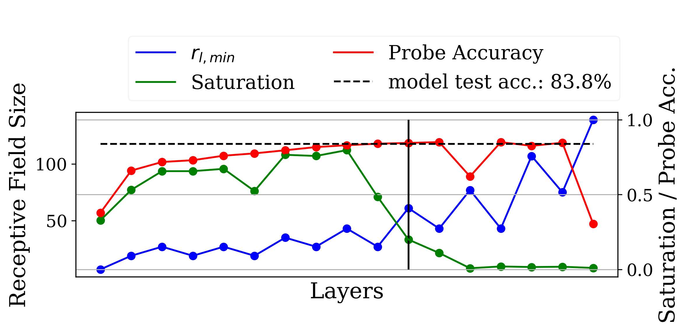
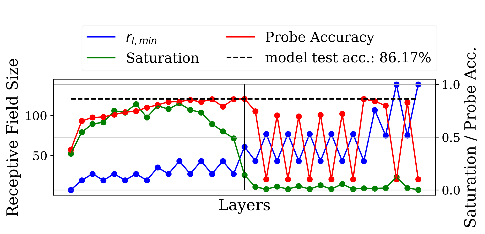
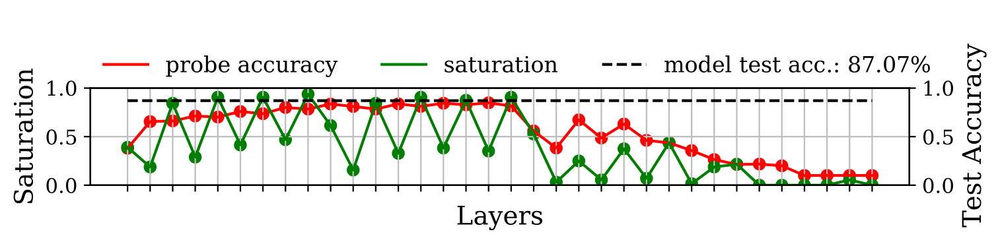
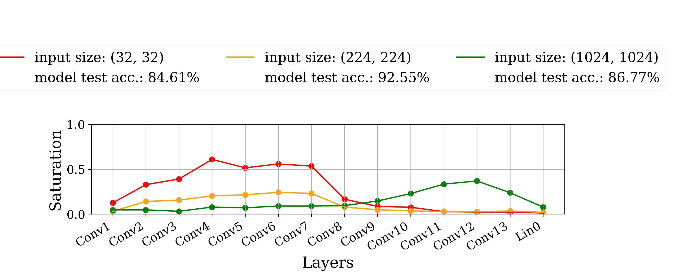

Academic Gallery
================

Delve has been used in several papers:

ResNet18 trained on Cifar10 for 30 epochs using the adam optimizer and a batch size of 64. Image from `"Should You Go Deeper? Optimizing Convolutional Neural Networks without training" <https://arxiv.org/abs/2106.12307>`_.

ResNet34 trained on Cifar10 for 30 epochs using the adam optimizer. Image from `"Should You Go Deeper? Optimizing Convolutional Neural Networks without training" <https://arxiv.org/abs/2106.12307>`_.

DenseNet18 trained on Food101 for 90 epochs using the stochastic gradient decent optimizer and a batch size of 128. Image from `"Feature Space Saturation During Training" <https://arxiv.org/abs/2006.08679>`_.

VGG16 trained on 3 different resolutions for 30 epochs using the Adam-optimizer and a batch size of 32. You can see the shift in the inference process by observing the shift in high saturation values. Image from `"(Input) Size Matters for Convolutional Neural Network Classifiers" <https://www.springerprofessional.de/en/input-size-matters-for-cnn-classifiers/19652392>`_.
